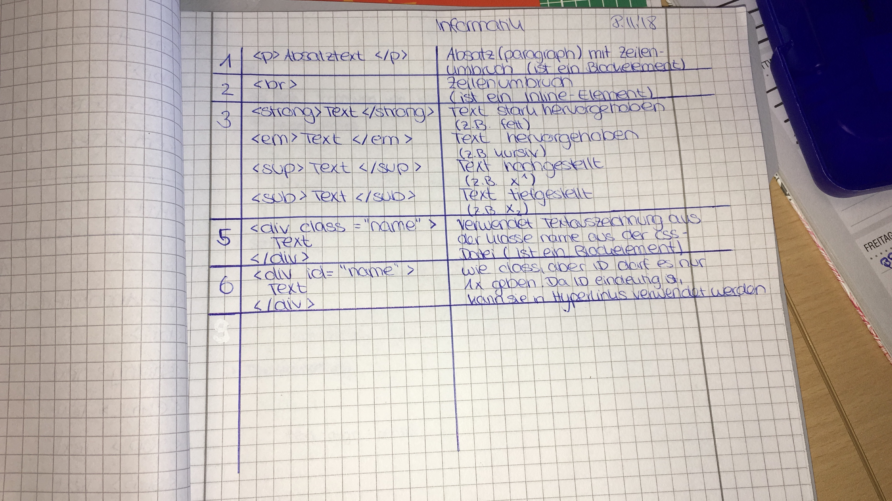
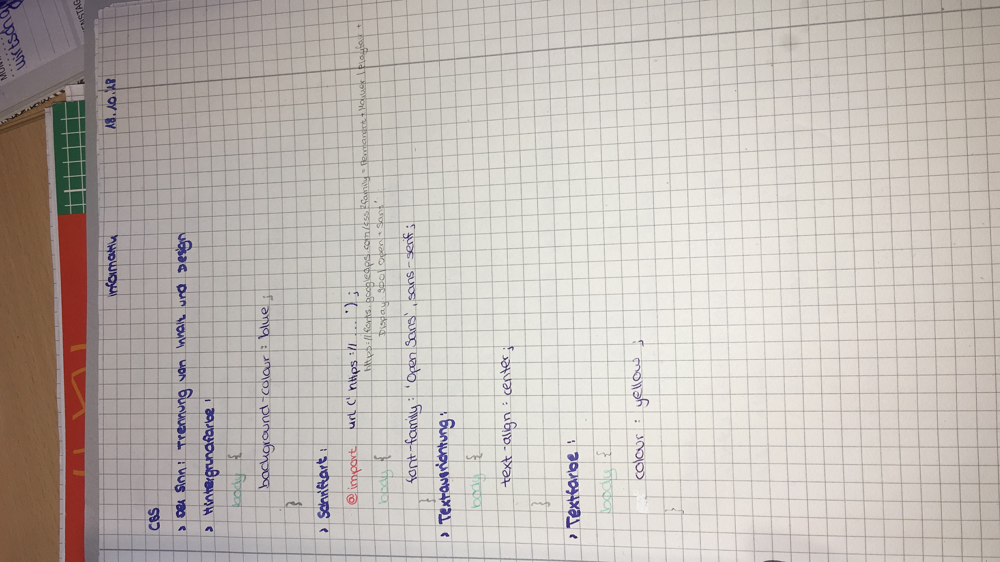
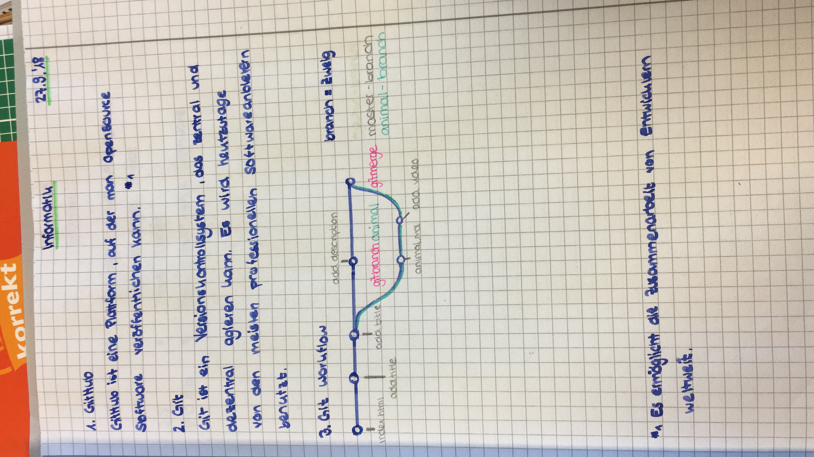
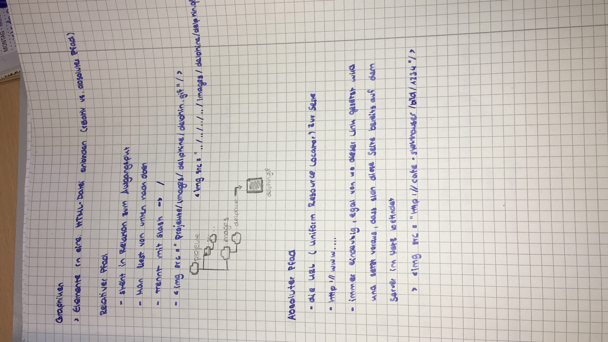
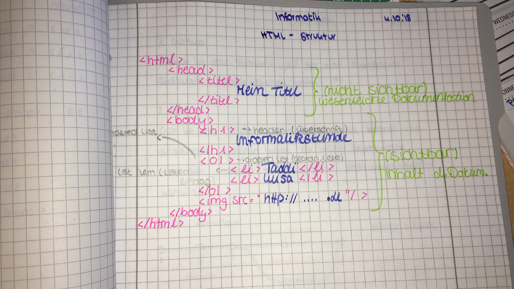
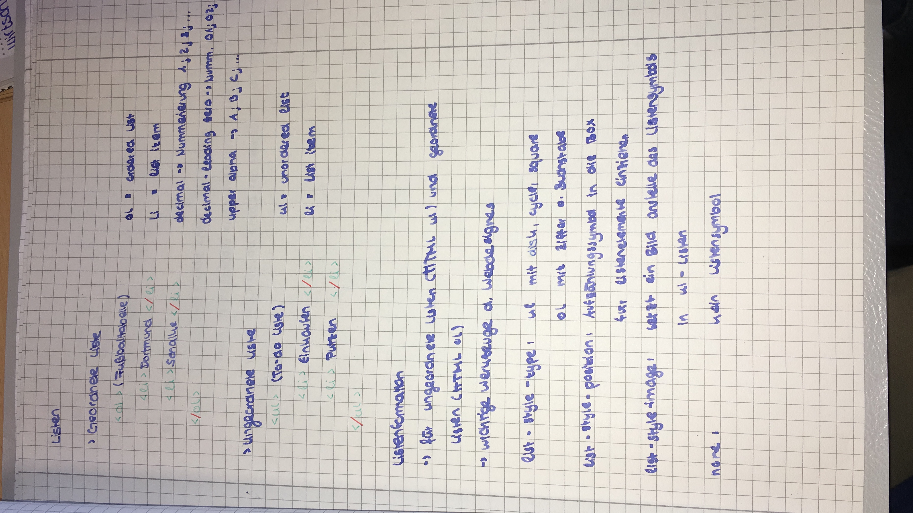
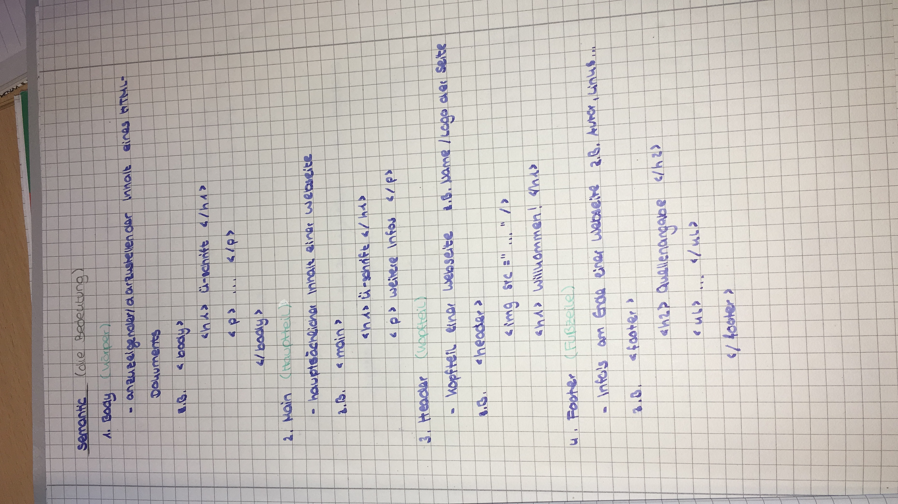
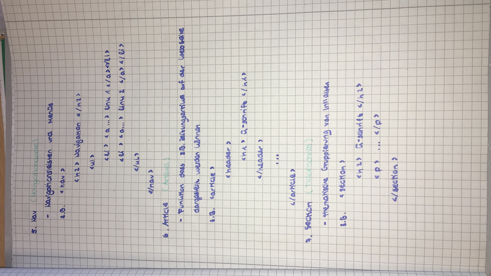
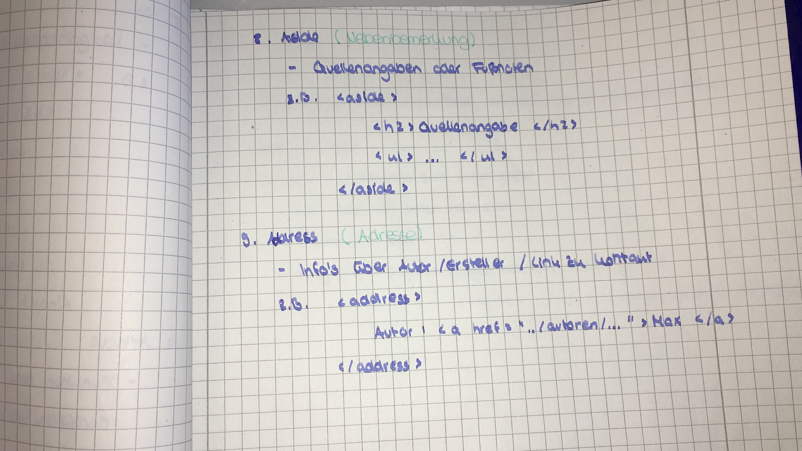
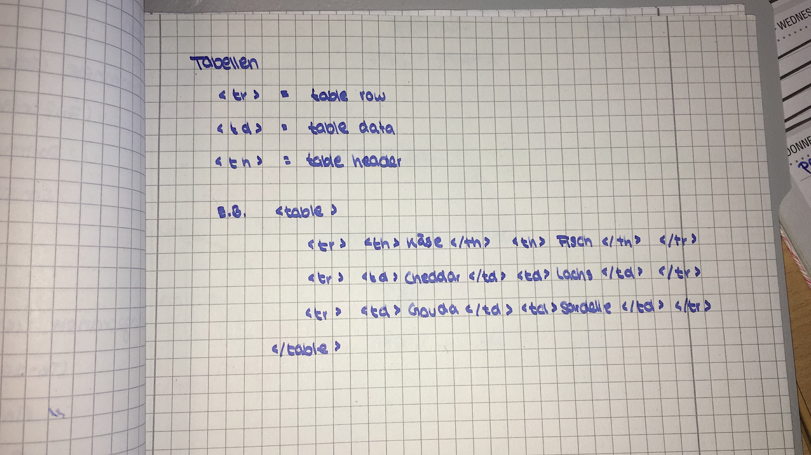

# Klausurthemen

* absatz-zeilenumbruch
* css
* github-git
* grafiken
* html-grundstruktur
* listen
* semantic-html-1
* semantic-html-2
* semantic-html-3
* tabellen

# Aufschriebe

> “Informatik HTML Aufschriebe 2018” by [HannahKup](https://github.com/HannahKup) is licensed under [CC BY 2.0](https://creativecommons.org/licenses/by/2.0/)

* 
* 
* 
* 
* 
* 
* 
* 
* 
* 
